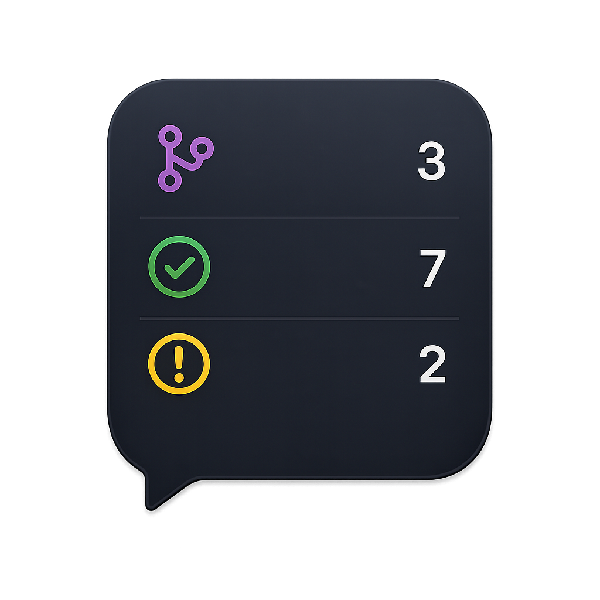
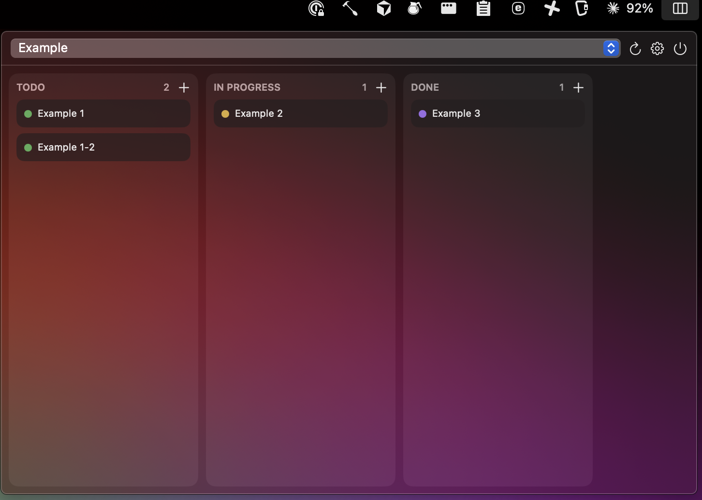
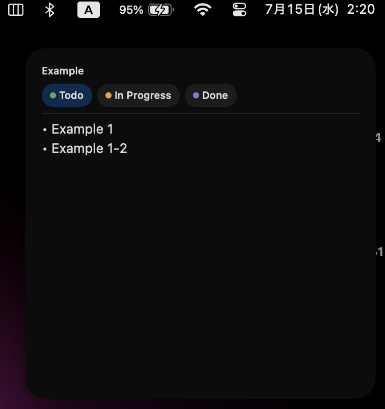

<p align="center">
  
</p>

<h1 align="center">GitHub Project Menu Bar</h1>

<p align="center">
  自分の <b>GitHub Projects (v2)</b> のボードを、macOSの<b>メニューバー</b>と<b>ウィジェット</b>から閲覧・編集できるネイティブアプリです。
</p>

<p align="center"><a href="../README.md">English</a> / 日本語</p>

## スクリーンショット

**メニューバーパネル** — カンバンボード。カードを**ドラッグ**して列（Status）を変更、**右クリック**でもStatus変更、**「＋」**でタスク追加、カードをクリックでGitHubを開きます。

<p align="center">
  
</p>

**ウィジェット** — 上部のStatusボタンをタップすると、そのStatusのタスクが表示されます。

<p align="center">
  
</p>

## 特徴

- メニューバーの**カンバンボード**: 閲覧・**ドラッグ＆ドロップでStatus変更**・タスク追加（ドラフトIssue）・GitHubで開く
- **GitHubと同じ並び**: プロジェクトビューで設定したソート順を再現
- **Status色**: 各カードにStatusの色ドットを表示
- **インタラクティブなウィジェット**: Statusを選んでタスク一覧を表示（読み取り専用・自動更新）
- **メニューバー常駐**: Dockアイコンなし。アイコンからパネルが開きます

## 技術スタック

| レイヤー | 採用 |
|---|---|
| アプリ本体 | SwiftUI `MenuBarExtra`（Dockアイコンなし） |
| ウィジェット | WidgetKit ＋ インタラクティブ AppIntents |
| GitHub API | Projects v2 **GraphQL**（URLSession） |
| トークン／共有状態 | OS **Keychain**（本体とウィジェットで共有） |
| プロジェクト生成 | [XcodeGen](https://github.com/yonaskolb/XcodeGen)（`project.yml`） |

サードパーティ製の実行時依存はありません（Foundation / SwiftUI / WidgetKit / AppIntents / Security のみ）。

## ディレクトリ構成

```
project.yml            XcodeGen定義（App＋Widget＋Tests、Team固定）
build.sh               CLIビルド → 署名 → /Applications へインストール → 起動
test.sh                CLIユニットテスト
Entitlements/          App.entitlements / Widget.entitlements
Sources/
  Shared/              App と Widget の両方にコンパイルされる共通コード
    AppConfig / TokenStore(＋SharedStore, BoardCache) / Models
    GitHubAPI（GraphQL＋ビューのソート再現）/ StatusColor / SelectStatusIntent
  App/                 MenuBarExtra アプリ ＋ Assets.xcassets（AppIcon）
  Widget/              WidgetKit: プロバイダ＋ビュー
Tests/                 共通ロジックのユニットテスト
```

`.xcodeproj` と `Generated/` は XcodeGen の生成物で **gitignore** しています。**source of truth は `project.yml`** です。

## 必要なもの

- **Xcode** 本体（フル版）
- **XcodeGen** — `brew install xcodegen`

## ビルド＆インストール（Xcodeを開かずに実行）

```bash
./build.sh
```

プロジェクト再生成 → 署名付きReleaseビルド → `/Applications/GitHubProjectMenuBar.app` にインストール → 起動、までを自動で行います。

> **無料のPersonal Team**（`project.yml` の `DEVELOPMENT_TEAM`）で署名します。
> 無料Teamのプロビジョニングは**約7日で失効**するので、切れたら `./build.sh` を再実行してください。

## 使い方

1. メニューバーのアイコンをクリック → **⚙ 設定** → GitHub の **Classic PAT**（`project` スコープ。プライベートリポジトリのIssue/PRを扱うなら `repo` も）を貼り付け
2. プロジェクトを選択 → ボードが読み込まれます
3. **ウィジェットを編集**（通知センター／デスクトップ）から「GitHub Project」を追加

トークンは OS **Keychain** に保存され、Keychainアクセスグループで本体↔ウィジェットが共有します（無料Apple IDで動作。App Groupは不要）。

## テスト

```bash
./test.sh
```

共通ロジック（ビューのソート再現・モデル）のユニットテストがあります。

## Xcodeで開く場合（任意）

```bash
xcodegen generate && open GitHubProjectMenuBar.xcodeproj
```

## 補足・既知の制約

- **手動ドラッグの並び順**（ソート未設定）はGitHub APIが公開しておらず再現できません。ビューで**フィールドソート**を設定している場合のみ順序が一致します。
- ウィジェットは WidgetKit の仕様上**読み取り専用**で、更新はタイムラインに依存します。Statusボタンの切り替えはキャッシュから即時描画されます。
- **自分のMac専用**（無料Team）。配布は不可で、他人が使うには各自の Apple ID / Team ID でビルドが必要です。
